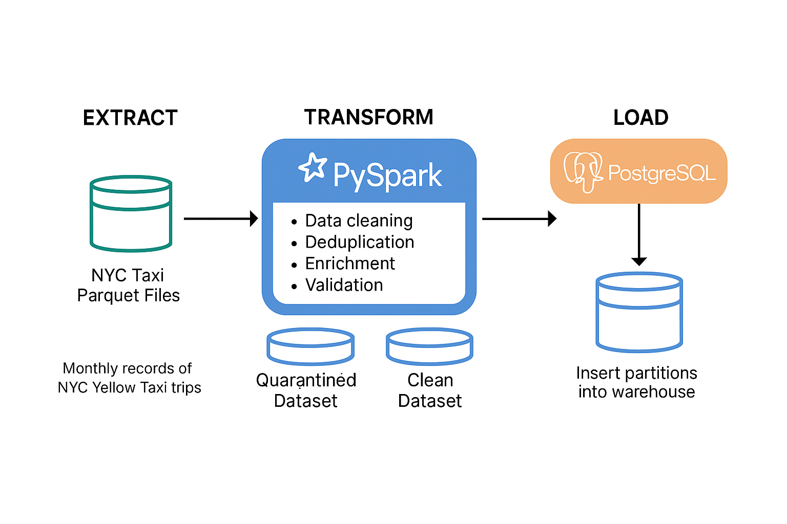

# NYC Yellow Taxi ETL Pipeline (PySpark + PostgreSQL)

A production-grade ETL pipeline built using PySpark to process, clean, enrich, and load NYC Yellow Taxi Trip records into PostgreSQL. This project simulates real-world batch data engineering workflows including schema enforcement, data quality checks, enrichment, and warehouse loading.



---

## Project Highlights

- 📁 **Data Source**: NYC TLC Yellow Taxi public dataset (~100M+ records)
- ⚙️ **Technologies**: PySpark, Python, PostgreSQL, dotenv, DBeaver
- 🧼 **Transformations**:
  - Schema enforcement with `StructType`
  - Deduplication, filtering, null handling
  - Feature engineering (`trip_duration`, `avg_speed`, `trip_type`)
  - Enrichment with taxi zone names (`Pickup_Zone`, `Dropoff_Zone`)
  - Quarantine of invalid rows with rejection tracking
- 🧩 **Loading**: Partitioned data written into PostgreSQL via JDBC
- 📂 **Folder Structure**:
  - `extract.py`, `transform.py`, `load.py`
  - `/data/raw`, `/data/clean`, `/data/quarantine`
  - `.env` config for paths and DB credentials

---

## How to Run This Project

### 1. Clone the Repository

```bash
git clone https://github.com/your-username/nyc-yellow-taxi-etl.git
cd nyc-yellow-taxi-etl
